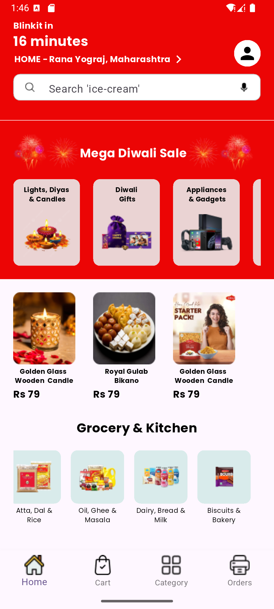
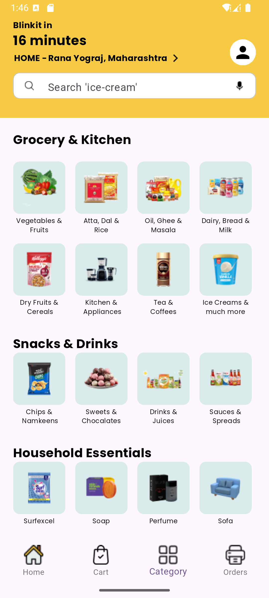
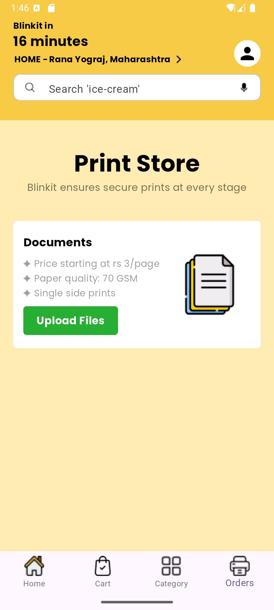

Here’s a well-structured README file for your **Blinkit UI App**:

---

# Blinkit UI App 🚀

Welcome to the **Blinkit UI App**! This project replicates the sleek and modern user interface of the Blinkit grocery delivery app using Flutter. The design ensures a seamless user experience with smooth transitions and an intuitive layout.

---

## 🖼️ App UI Screenshots

  
  
  


---

## 📖 Features

✅ **Modern UI** – A clean and interactive design inspired by Blinkit  
✅ **Smooth Animations** – Enhances user experience with transitions  
✅ **Custom Fonts** – Integrated for a polished look

---

## 🚀 Getting Started

### Prerequisites

Ensure you have the following installed:

- **Flutter SDK** – [Install Flutter](https://flutter.dev/docs/get-started/install)
- **Dart** – Comes with Flutter
- **Android Studio** or **VS Code** – Recommended IDEs

### Steps to Run the Project

1. Clone the repository:
   ```bash
   git clone https://github.com/deveRana/100-Flutter-Projects.git
   cd 100-Flutter-Projects/blinkit_ui
   flutter pub get
   flutter run
   ```

---

## 🛠 Tech Stack

- **Flutter** – UI framework
- **Dart** – Programming language
