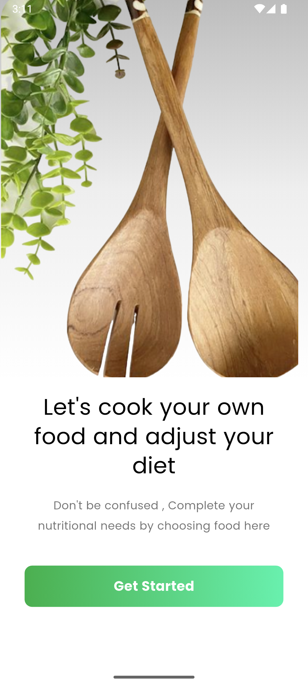
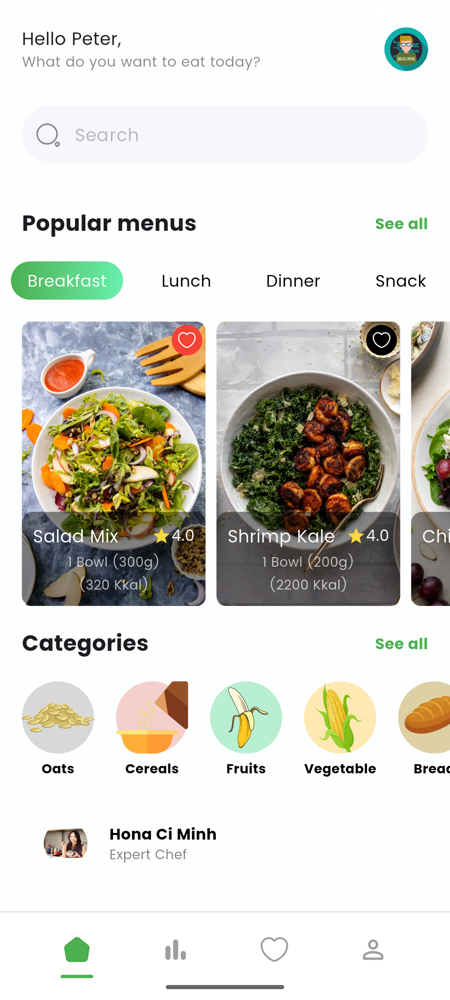
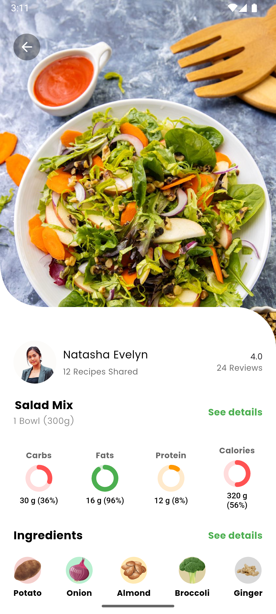

# Recipe App UI 🍳

Welcome to the **Recipe App UI**! This project showcases a visually appealing and intuitive user interface for a recipe app. It features a modern design, smooth animations, and an engaging onboarding experience for users. 🌟

---

## 🖼️ App UI Screenshot




---

## 📖 Features
- **Onboarding Screens**: Beautifully designed onboarding screens to guide users through the app's features.
- **Custom Fonts**: Integrated "Poppins" font for a clean and professional look.
- **Responsive Design**: Optimized for various screen sizes and orientations.
- **Light and Dark Status Bar Styling**: Seamless integration with the system UI for a modern appearance.
- **Smooth Navigation**: Elegant transitions between screens.

---

## 🚀 Getting Started
### Prerequisites
Ensure you have the following installed on your system:
- **Flutter SDK**: [Install Flutter](https://flutter.dev/docs/get-started/install)
- **Dart**: Comes with Flutter
- **Android Studio** or **VS Code**: Recommended IDEs for Flutter development

### Steps to Run the Project
1. Clone the repository:
   ```bash
   git clone https://github.com/deveRana/100-Flutter-Projects.git
   cd 100-Flutter-Projects/recipe_app_ui
   flutter pub get
   flutter run